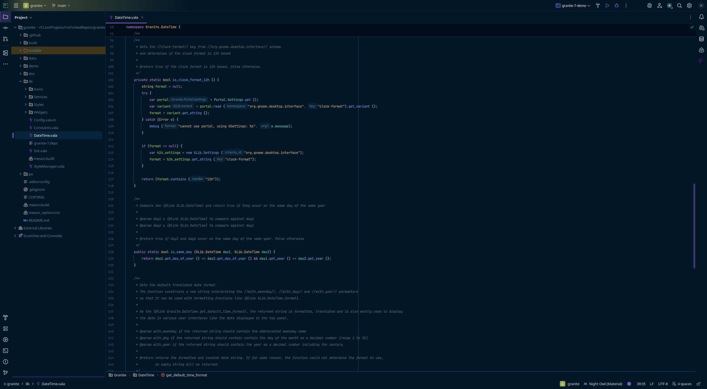
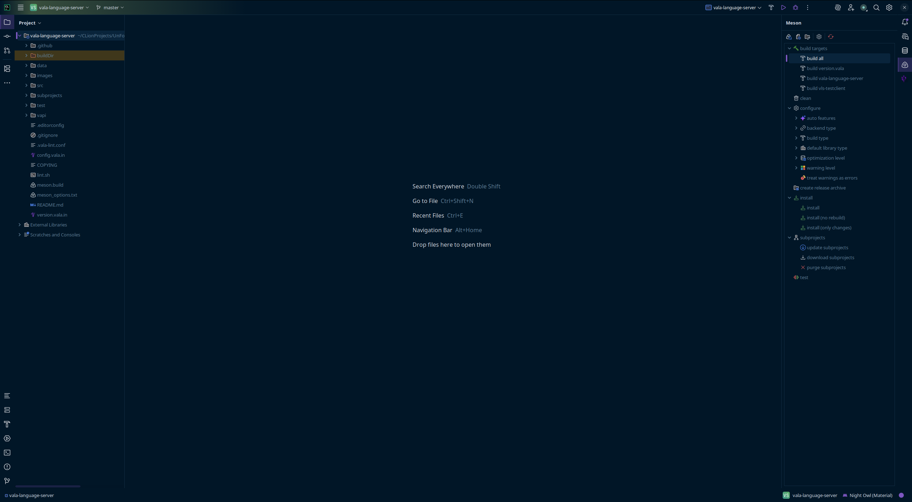
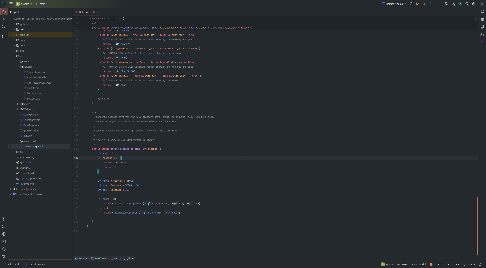
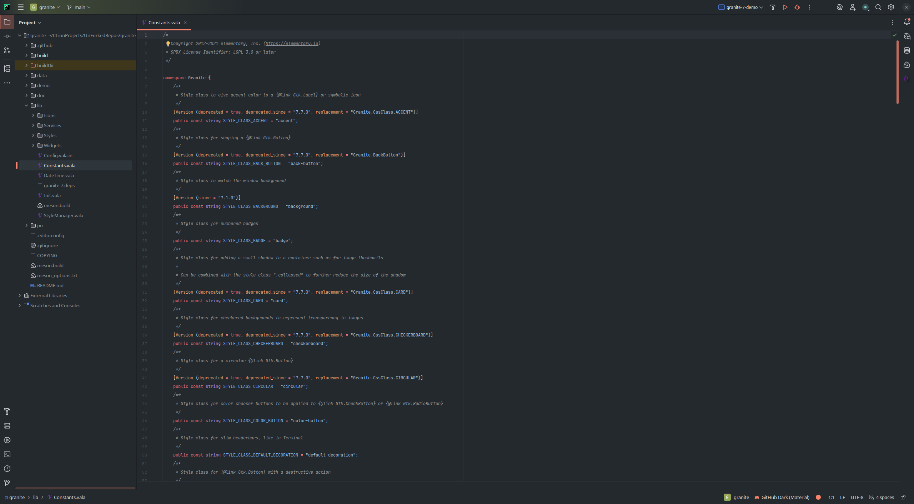
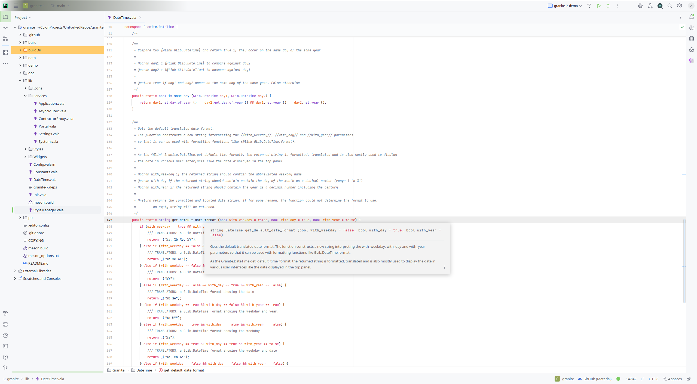

# Vala Language for JetBrains IDEs

            
This plugin provides syntax highlighting, code completion, integrated documentation, and more. This currently is in an early stage of development. 
Most luxuries of JetBrain IDEs are not implemented yet or are limited.

A Language Server Protocol (LSP) is used to provide many features, including documentation, code completion, syntax checking, etc.
The supported LSP is required to be installed separately for now. More details for the LSP are available [here](https://github.com/Tbusk/vala-jetbrains-plugin/blob/main/docs/LanguageServer.md).

> [!NOTE]
> The IDE most compatible currently is CLion because Meson is supported. 
> 
> If you wish to use another IDE, note you must run meson builds via the command line every now and then if your project uses meson.

## Installation

- Using the IDE built-in plugin system:
  
  <kbd>Settings/Preferences</kbd> > <kbd>Plugins</kbd> > <kbd>Marketplace</kbd> > <kbd>Search for "Vala Language"</kbd> >
  <kbd>Install</kbd>
  
- Using JetBrains Marketplace:

  Go to [JetBrains Marketplace](https://plugins.jetbrains.com/plugin/27464-vala-language) and install it by clicking the <kbd>Install to ...</kbd> button in case your IDE is running.

  You can also download the [latest release](https://plugins.jetbrains.com/plugin/27464-vala-language/versions) from JetBrains Marketplace and install it manually using
  <kbd>Settings/Preferences</kbd> > <kbd>Plugins</kbd> > <kbd>⚙️</kbd> > <kbd>Install plugin from disk...</kbd>

- Manually:

  Download the [latest release](https://github.com/Tbusk/vala-jetbrains-plugin/releases/latest) and install it manually using
  <kbd>Settings/Preferences</kbd> > <kbd>Plugins</kbd> > <kbd>⚙️</kbd> > <kbd>Install plugin from disk...</kbd>

## Screenshots

